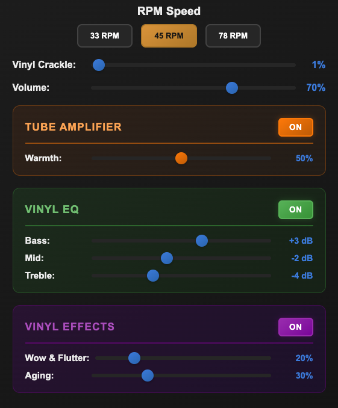

# Vinyl Audio Player

A web-based audio player that simulates the experience of playing vinyl records with authentic features like variable RPM speeds and vinyl crackle sound effects.

## Features

- **Animated Vinyl Record**: Visual spinning animation that matches the selected RPM
- **Multiple RPM Settings**: Switch between 33, 45, and 78 RPM speeds
- **Vinyl Crackle Effect**: Adjustable background noise that simulates authentic vinyl surface noise and pops
- **Playback Speed Control**: RPM settings affect actual audio playback speed
- **Volume Control**: Independent volume adjustment
- **Vintage Design**: Classic turntable aesthetic with tonearm

## How to Use

1. Open `index.html` in a web browser
2. Click the file input to select an audio file from your computer (supports MP3, WAV, OGG, etc.)
3. Click **Play** to start playback
4. Select different **RPM speeds**:
   - **33 RPM**: Slower playback (0.73x speed)
   - **45 RPM**: Standard playback (1.0x speed) - default
   - **78 RPM**: Faster playback (1.73x speed)
5. Adjust the **Vinyl Crackle** slider to control background noise intensity (0-100%)
6. Use the **Volume** slider to adjust audio level
7. Use **Pause** or **Stop** buttons to control playback

## Technical Details

- Pure HTML, CSS, and JavaScript (no dependencies)
- Uses Web Audio API for vinyl crackle generation
- CSS animations for vinyl rotation
- Responsive design

## Browser Compatibility

Works in all modern browsers that support:

- Web Audio API
- HTML5 Audio
- CSS3 Animations

Try at:
* https://audio-research-projects.github.io/vinyl-simulator
* https://audio-research-projects.github.io/vinyl-simulator/twin-peaks-fx-simulator/

## Files

- `index.html` - Main HTML structure
- `style.css` - Styling and animations
- `script.js` - Audio processing and playback logic
